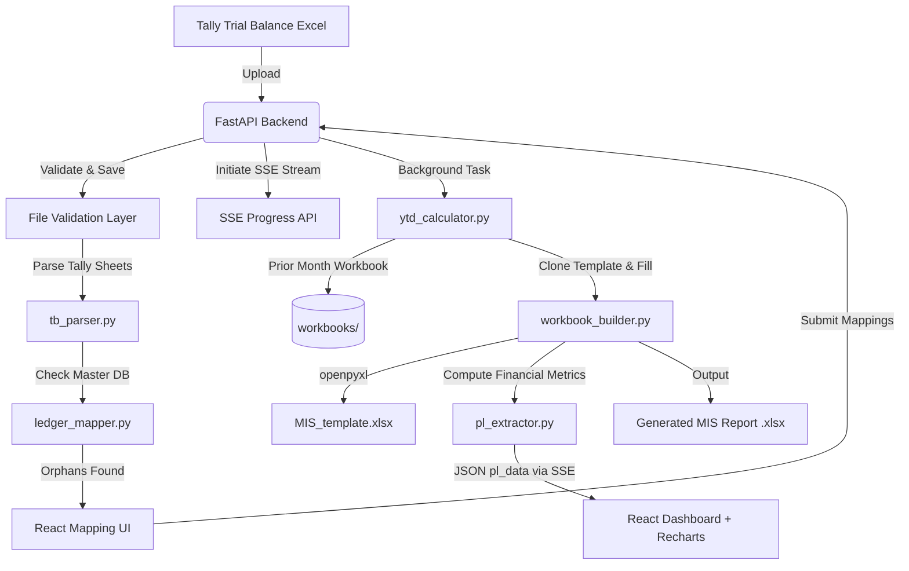

# 📊 Tally MIS P&L Automation Dashboard

An enterprise-grade **React + FastAPI** web dashboard that automates the monthly **Tally Prime → MIS Excel** workflow. Upload a Trial Balance export, map any new ledger accounts, generate a formula-intact Excel report, and explore an interactive multi-vertical P&L dashboard — all in one pipeline.

---

## 🚀 Key Features

| Feature | Description |
|---|---|
| 📥 **Trial Balance Parser** | Parses Tally Prime Excel exports, detecting `TB` / `TB YTD` sheets and extracting monthly + cumulative YTD balances |
| 🚦 **Dynamic Ledger Mapping** | Detects unmapped ledgers, halts execution, and presents a structured table UI for classification across Group, Head, Business Vertical, and Indirect Expense category |
| ⚡ **Direct Ledger Upload** | Upload custom master mapping sheets to bypass manual review and update the template instantly |
| 🔍 **Bulk Excel Resolver** | Drag-and-drop a custom mapping list when unmapped ledgers are found to automatically resolve matches instantly without manual dropdowns |
| ➕ **Custom Dropdown Options** | Users can type any custom value directly inside a mapping dropdown and save it to the master list on-the-fly |
| 🔄 **YTD Roll-Forward Engine** | If the TB export has no YTD columns, the system rolls forward YTD balances from the prior month's MIS workbook automatically |
| ⚠️ **YTD Data Not Available State** | When no YTD data and no prior workbook is provided, the YTD tab displays a premium glassmorphic warning card with actionable resolution steps |
| 🏗️ **Formula-Intact Excel Compiler** | Clones `MIS_template.xlsx`, injects ledger data into the `List of Ledgers` sheet, and preserves all VLOOKUP / SUMIF formulas in dependent P&L sheets |
| 📈 **Live Interactive Dashboard** | Multi-vertical P&L breakdown with Recharts area charts, 4 KPI cards (Revenue, Gross Margin %, Profit before Tax, Indirect Costs), and a full Statement of P&L table |
| 🛡️ **Comprehensive Error Handling** | Client-side file validation, SSE stream recovery, typed error categorisation (network / validation / parse / server), and dismissable error banners with hints |
| 📡 **Real-time SSE Progress** | Server-Sent Events (SSE) stream provides real-time UI updates during heavy processing (Parsing → YTD Roll-forward → Excel Generation → Dashboard Extraction) |

---

## 📒 How the Accounting Logic Works (CA Perspective)

This tool is built around the same structure a CA would use when preparing a monthly MIS P&L for a multi-vertical trading and services company. Here is how the accounting flows from the raw Tally export to the final report.

---

### 1. The Starting Point — Tally Trial Balance

Every month, Tally Prime is used to export a **Trial Balance (TB)** — the raw list of every ledger account with its **Opening Balance**, **total Debits**, **total Credits**, and **Closing Balance** for the month.

The closing balance of each ledger in Tally is the single source of truth used to build the entire MIS. The system reads the TB sheet directly from this Tally export.

> **YTD columns:** Tally can optionally export a second sheet with cumulative Year-to-Date (from April 1st) figures. If this sheet is present, it is merged in automatically. If not, the prior month's MIS workbook is used to calculate YTD by adding the current month's movement to the prior YTD closing.

---

### 2. The Core Engine: The Master Ledger Database & Catching Orphans

The app utilizes a "Source of Truth" mapping system. Every single penny must be accounted for before figures are dumped into the final report. Not all ledger names in Tally mean anything on their own (e.g. *"HDFC Bank - CC"* needs to be classified).

Your database mapping table assigns every ledger to:
- **Tally Parent Group** (e.g., P&L, BS)
- **App Target Head** (e.g., `1. Sales Accounts`, `5. Purchase Accounts`)
- **Classification** (e.g., `Salary & wages`, `Rent expenses`)
- **Business Vertical** (e.g., `Bluestreak`, `Clarus`, `IT`)

**The "Unmapped" Trap (Catching Orphans):**
When a user uploads a new Trial Balance, the pipeline compares every ledger name in the TB against the Master Ledger Database. If an orphan ledger is detected (a new ledger created during the month), the pipeline completely halts execution. The user is presented with a mapping UI to strictly classify these new ledgers before any mathematical compilation occurs.

> **Custom entries:** If a classification or vertical doesn't exist in the master list yet, the user can type a new one directly in the mapping screen — it gets saved permanently for all future months.

---

### 3. The P&L Structure — How the Statement is Built

Once every ledger is classified, the system builds a **multi-column P&L Statement** where each column is a business vertical. This mirrors the internal MIS format.

```
                      Bluestreak   Clarus    IT    Spices-AZ   Spices-V   Share Trading   Total
─────────────────────────────────────────────────────────────────────────────────────────────────
Sales                     ×           ×       ×        ×           ×            ×            ×
Less: COGS                ×           ×       ×        ×           ×            ×            ×
  (Purchases ± Stock Δ)
3. Direct Expenses        ×           ×       ×        ×           ×            ×            ×
  Port / Freight / etc.
─────────────────────────────────────────────────────────────────────────────────────────────────
Gross Margin              ×           ×       ×        ×           ×            ×            ×
Gross Margin %            ×           ×       ×        ×           ×            ×            ×
─────────────────────────────────────────────────────────────────────────────────────────────────
2. Indirect Income        ×           ×       ×        ×           ×            ×            ×
  FX Gain / Interest etc.
─────────────────────────────────────────────────────────────────────────────────────────────────
6. Indirect Expenses      ×           ×       ×        ×           ×            ×            ×
  Salary / Rent / etc.
─────────────────────────────────────────────────────────────────────────────────────────────────
Allocation of expenses:
  Factory                 ×           ×       ×        –           –            –            ×
  Office                  ×           ×       ×        –           –            –            ×
  Common                  –           ×       –        –           ×            –            ×
Total Indirect Costs      ×           ×       ×        ×           ×            ×            ×
─────────────────────────────────────────────────────────────────────────────────────────────────
Profit / (Loss) before Tax ×          ×       ×        ×           ×            ×            ×
Net Margin %              ×           ×       ×        ×           ×            ×            ×
```

**How COGS is calculated:**
> COGS = Opening Stock + Purchases − Closing Stock
>
> Purchases are all ledgers mapped to `5. Purchase Accounts`. Stock values come from the Opening/Closing balance of the *"Opening Stock"* ledger in the TB. Stock changes are attributed to the **Factory** vertical since that is where physical stock is held.

**How Direct Expenses are treated:**
> Expenses like Port charges, Freight, Insurance, and Export charges are mapped to `3. Direct Expense`. These are deducted from Sales before arriving at Gross Margin (just above COGS in the P&L), because they are directly tied to the cost of selling goods.

---

### 4. Shared Cost Allocation — Factory, Office & Common

Three verticals — **Factory**, **Office**, and **Common** — do not generate revenue independently. Their costs are shared overheads that must be allocated to the revenue-generating verticals.

| Overhead Pool | What it Contains | How it is Allocated |
|---|---|---|
| **Factory** | Manufacturing overhead — utilities, labour, factory-specific indirect expenses | Divided equally (⅓ each) across **Bluestreak**, **Clarus**, and **IT** |
| **Office** | Central office running costs — rent, office salaries, admin | Divided equally (⅓ each) across **Bluestreak**, **Clarus**, and **IT** |
| **Common** | Shared costs that apply to multiple businesses — common bank charges, shared professionals, etc. | Allocated proportionally to **Clarus** and **Spices - Vashi** based on their **share of total Sales** |

> This replicates the exact SUMIF / ratio formulas used in the master Excel template, so the Python dashboard and the downloaded Excel always agree.

---

### 5. Year-to-Date (YTD) — Cumulative from April 1st

India follows a financial year from **April 1st to March 31st**. All YTD figures in this system accumulate from the start of that fiscal year.

**How YTD is sourced:**

1. **Best case — Tally exports YTD:** Tally Prime can be configured to export a second `TB YTD` sheet with cumulative figures. The system detects this automatically and uses it directly.

2. **Roll-forward — No YTD sheet available:** If the Tally export only has monthly figures, the system reads the **Closing YTD** values from the prior month's finished MIS workbook and adds the current month's movement:
   ```
   YTD Closing (This Month) = YTD Closing (Prior Month) + Current Month Movement
   ```

3. **First month of the year / No prior workbook:** YTD = Monthly figures (April is both the monthly and YTD period).

> If neither a YTD sheet nor a prior workbook is provided, the system still works but marks the YTD tab as **"Not Available"** — no guesses are made with incomplete data.

---

### 6. What the Generated Excel Contains

The downloaded `.xlsx` file is a **formula-intact clone** of the master MIS template. It has:

- **`TB` sheet** — the raw monthly Trial Balance data injected from Tally
- **`TB YTD` sheet** — the cumulative YTD Trial Balance (rolled forward or directly from Tally)
- **`List of Ledgers` sheet** — every ledger with its mapping attributes and VLOOKUP formulas that pull figures from the TB sheets
- **All downstream P&L, COGS, Summary, and Dashboard sheets** — these use Excel VLOOKUP / SUMIF / IFERROR formulas that reference `List of Ledgers` and recalculate automatically when opened in Microsoft Excel

The generated file is ready to be opened, reviewed, and shared — no manual data entry required.

---

## 🛠️ Architecture & Tech Stack



### Technology Matrix

| Layer | Technology |
|---|---|
| **Frontend** | React 18, Vite, TypeScript, Vanilla CSS (glassmorphism), Recharts, Lucide Icons |
| **Backend** | FastAPI, Python 3.11+, Uvicorn (ASGI) |
| **Excel Engine** | `openpyxl` |
| **Data Validation** | Pydantic v2 |
| **Dev Orchestration** | `concurrently` (npm) |

> **Note:** The README previously listed Tailwind CSS, Zustand, and TanStack Query — these are **not** used. Styling is plain Vanilla CSS with CSS custom properties.

---

## 📁 Repository Structure

```text
Invoice Dashboard/
├── .agent/                      # Antigravity agent config, skills & workflows
├── backend/
│   ├── main.py                  # FastAPI app — routes, validation, session management
│   ├── requirements.txt         # Python dependencies
│   ├── models/
│   │   ├── ledger.py            # LedgerEntry, LedgerMapping, SessionMappingState schemas
│   │   └── pl_data.py           # PLRow, PLBreakdown, PLDataResponse schemas (+ has_ytd flag)
│   ├── services/
│   │   ├── tb_parser.py         # Tally TB Excel parser (monthly + YTD sheet merge)
│   │   ├── ledger_mapper.py     # Mapping rule loader & template appender
│   │   ├── ytd_calculator.py    # YTD detection & roll-forward from prior workbook
│   │   ├── workbook_builder.py  # Template clone & data injection via openpyxl
│   │   └── pl_extractor.py      # Multi-vertical P&L computation (6 categories, 11 verticals)
│   ├── uploads/                 # Temp storage for uploaded files (git-ignored)
│   └── workbooks/               # Generated monthly MIS output files (git-ignored)
├── docs/
│   └── PLAN-mis-automation.md   # Implementation plan & milestone log
├── frontend/
│   ├── src/
│   │   ├── App.tsx              # Full React SPA — 3-stage wizard (Upload → Mapping → Dashboard)
│   │   └── index.css            # Design system — dark glassmorphism, CSS variables, animations
│   ├── package.json
│   └── tsconfig.json
├── templates/
│   └── MIS_template.xlsx        # Master Excel template with formulas intact
├── package.json                 # Root orchestrator (install:all, dev, dev:frontend, dev:backend)
└── .gitignore
```

---

## ⚙️ Installation & Setup

### Prerequisites
- **Node.js** v18+
- **Python** v3.11+

### One-Command Install (Recommended)

From the project root:
```bash
npm run install:all
```
This installs frontend npm packages and backend Python dependencies simultaneously.

### Manual Setup

#### Frontend
```bash
cd frontend
npm install
```

#### Backend
```bash
cd backend

# Create and activate a virtual environment (recommended)
python -m venv venv

# Windows (PowerShell):
venv\Scripts\Activate.ps1
# macOS / Linux:
source venv/bin/activate

pip install -r requirements.txt
```

---

## 🏃 Running Locally

### Both Servers (Recommended)
```bash
npm run dev
```
Spins up both servers concurrently:
- **Frontend:** [http://localhost:5173](http://localhost:5173)
- **Backend API:** [http://127.0.0.1:8000](http://127.0.0.1:8000)
- **API Docs (Swagger):** [http://127.0.0.1:8000/docs](http://127.0.0.1:8000/docs)

### Individual Servers
```bash
npm run dev:frontend   # Vite dev server only
npm run dev:backend    # FastAPI + Uvicorn only (hot-reload enabled)
```

---

## 🔄 Pipeline Walkthrough

### Stage 1 — Upload
1. Select the report **Month** and **Fiscal Year**.
2. Upload the **Active Trial Balance** (`.xlsx` / `.xls`, max 50 MB) exported from Tally Prime.
3. Optionally upload the **Prior Month MIS Workbook** to enable YTD roll-forward.
4. Optionally upload a custom **List of Ledgers** file. You can choose to **Apply Directly** (instant update) or **Review & Edit First**.
5. Click **Proceed to Mapping Check**.

### Stage 2 — Ledger Mapping *(skipped if all ledgers are already mapped)*
1. Any ledger not present in the master mapping template is listed in a structured table.
2. **Bulk Resolve via Excel:** Drop a master ledger list Excel workbook in the resolver zone to instantly auto-populate matching ledgers.
3. For remaining ledgers, select the **Accounting Head**, **Group** (BS/P&L), **Classification**, and **Business Vertical**.
4. Use **+ Add Custom…** in any dropdown to create a new option that persists for future months.
5. Click **Approve Mappings & Build MIS** to trigger Excel generation.

### Stage 3 — Interactive Dashboard
- Switch between **Monthly Review** and **YTD Review** tabs.
- If no YTD data is available, the YTD tab shows a friendly warning with resolution steps instead of empty charts.
- Download the generated `.xlsx` workbook using the **Download Excel** button.
- Use **Start New Month** to reset and begin a new month's pipeline.

---

## 🔌 API Reference

| Method | Endpoint | Description |
|---|---|---|
| `GET` | `/api/domain-lists` | Returns dropdown options (groups, heads, verticals, classifications) |
| `POST` | `/api/upload` | Upload TB file + optional prior workbook; returns unmapped ledgers or full `pl_data` |
| `POST` | `/api/map` | Submit ledger mappings; triggers workbook generation; returns `pl_data` |
| `POST` | `/api/parse-ledgers` | Parses an uploaded List of Ledgers Excel file for review or bulk resolution |
| `POST` | `/api/confirm-ledgers` | Submits edited mappings to permanently replace the 'List of Ledgers' sheet |
| `POST` | `/api/upload-ledgers-direct` | Parses and immediately applies an uploaded List of Ledgers Excel file |
| `GET` | `/api/download?session_id=...` | Stream the generated `.xlsx` MIS report |

### `POST /api/upload` — Request
| Field | Type | Required | Description |
|---|---|---|---|
| `file` | `File` (.xlsx/.xls) | ✅ | Active monthly Trial Balance |
| `prior_file` | `File` (.xlsx/.xls) | ❌ | Prior month MIS for YTD roll-forward |
| `month` | `int` (1–12) | ✅ | Report month number |
| `year` | `int` (2000–2100) | ✅ | Report fiscal year |

### `POST /api/upload` — Response
```jsonc
// All ledgers mapped → jump straight to dashboard
{
  "success": true,
  "session_id": "uuid",
  "output_file": "MIS_Report_2026_03.xlsx",
  "pl_data": { "month_label": "Mar'26", "ytd_label": "YTD'26", "has_ytd": true, ... }
}

// Unmapped ledgers found → redirect to mapping step
{
  "success": false,
  "session_id": "uuid",
  "unmapped_count": 3,
  "unmapped_ledgers": ["Ledger A", "Ledger B", "Ledger C"]
}
```

---

## 🛡️ Error Handling

### Backend
- **422** — File is not `.xlsx`/`.xls`, or month/year out of range
- **413** — File exceeds 50 MB limit
- **400** — TB sheet not found, zero rows parsed, or invalid mapping schema
- **404** — Session expired or not found
- **500** — YTD calculation, workbook generation, or P&L extraction failure (all with specific messages)
- Global unhandled exceptions return structured `{detail, hint}` JSON (never raw HTML)

### Frontend
- **Pre-flight validation** — file extension and size checked client-side before any network call
- **120s timeout** — `AbortController` prevents indefinite hangs on large files
- **Typed error categories** — `network` / `validation` / `parse` / `server` with distinct UI treatment
- **Backend offline banner** — detected on page load via the `/api/domain-lists` connectivity check
- **Dismissable error panel** — `✕` close button + `💡` hint line for actionable guidance
- **Retry button** — shown automatically for network-category errors

---

## 🗂️ Key Design Decisions

| Decision | Rationale |
|---|---|
| In-memory session store (`SESSIONS` dict) | Keeps the backend stateless-friendly and dependency-free for single-user local use; replace with Redis for multi-user deployments |
| `openpyxl` over `xlwings` / `xlrd` | Cross-platform, no Excel installation required, full formula write support |
| `abs()` on Credit balance values | Tally Prime exports Credit accounts (Revenue, Sales) as negative closing values; wrapping in `abs()` ensures correct chart rendering |
| YTD `has_ytd` flag in API response | Allows the frontend to gracefully degrade the YTD tab without requiring a separate API call |
| Vanilla CSS over Tailwind | Full design control with glassmorphism, CSS custom properties, and micro-animations without build-time purging complexity |

---

## 📄 License

Private — Internal MIS automation tool. Not licensed for redistribution.
